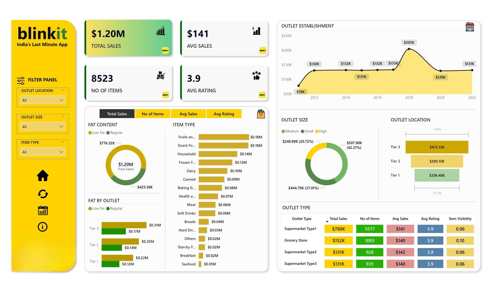

# 🛒 Blinkit Data Analysis — Power BI Dashboard

  

## Overview
Interactive **Power BI** dashboard to analyze Blinkit’s **sales**, **customer satisfaction (ratings)**, and **inventory/outlet performance**. Built for quick executive scan and self-service drilldowns across outlet **location**, **size**, and **type**, plus item categories.

## Key Features
- **KPI-driven visuals:** Total Sales, Avg Sales, No. of Items, Avg Rating.
- **Interactive filters:** Outlet **Location, Size, Type**, Item Type, Fat Content.
- **Drilldowns & comparisons:** Bar, donut, stacked column, line, and matrix visuals.
- **Clean data model:** Prepped measures and filters for smooth exploration.
